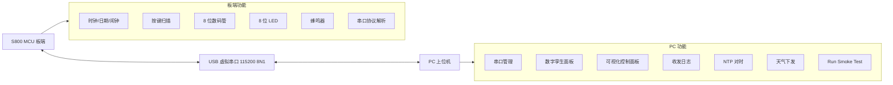

# S800 智能联网时钟系统最终报告

## 1. 项目概述

本项目基于 S800 扩展板、EK-TM4C1294XL 主控板和 Python/PyQt5 PC 上位机，实现了一个智能联网时钟系统。系统由 MCU 板端固件和 PC 上位机两部分组成，板端能够在不连接 PC 的情况下独立完成时间显示、日期显示、闹钟、按键编辑、LED 状态指示等基础功能；PC 端通过 USB 虚拟串口与板端通信，实现远程控制、状态监视、数字孪生显示和扩展联网功能。

项目最终目标是完成“板端本地可独立运行 + PC 上位机双向镜像控制”的完整系统，并具备工程化提交质量。

## 2. 系统组成

### 2.1 MCU 板端

板端主程序位于：

```text
ARM/exp3-1.c
```

主要职责：

- 维护时间、日期、闹钟和系统状态。
- 驱动 8 位七段数码管显示。
- 扫描 8 个 I2C 按键和 USER1/USER2 独立按键。
- 控制 8 位 LED 状态。
- 控制蜂鸣器。
- 实现 UART 串口协议解析。
- 主动上报 `*EVT:DISP`、`*EVT:LED`、`*EVT:KEY`、`*EVT:MODE` 等事件。

### 2.2 PC 上位机

PC 上位机位于：

```text
pc_host/
```

主要文件：

| 文件 | 作用 |
|---|---|
| `main.py` | PyQt5 主窗口、控制面板、日志、自动测试 |
| `serial_worker.py` | 串口扫描、连接、后台接收、节流发送 |
| `protocol.py` | 协议解析与命令格式化 |
| `twin_panel.py` | 数字孪生面板，包含数码管、LED、按键 |
| `ntp_helper.py` | NTP 对时辅助 |
| `weather_helper.py` | 天气获取与天气命令生成 |
| `smoke_test.py` | 协议解析本地 smoke test |
| `verify_env.ps1` | PC 虚拟环境检查脚本 |

## 3. 系统架构



板端和 PC 端通过统一的 ASCII 行协议通信。板端负责实时状态和硬件执行，PC 负责可视化控制、联网功能和自动化测试。

## 4. 板端功能实现

### 4.1 时间与日期

板端使用 1 ms 系统节拍维护时间。默认显示格式为：

```text
HH.MM.SS
```

按 `DISP` 可在以下三种显示之间循环：

```text
时间 -> 短日期 -> 长日期 -> 时间
```

短日期示例：

```text
26.06.10
```

长日期示例：

```text
2026.0610
```

系统支持闰年和月份天数处理。

### 4.2 显示方向与滚动

系统支持 LEFT/RIGHT 两种显示方向。RIGHT 模式下仅反转有效显示位，并重新计算小数点位置。例如：

```text
14.15.20 -> 02.51.41
```

超过 8 位的消息支持滚动显示。长消息滚动一整圈后自动回到时间显示，短消息显示约 3 秒后回到时间显示。

### 4.3 按键功能

| 按键 | 功能 |
|---|---|
| `FUNC` | 进入或切换编辑模式；闹钟响铃时关闭闹钟 |
| `SHIFT` | 编辑时切换字段 |
| `ADD` | 编辑时当前字段加 1 |
| `SAVE` | 保存并退出编辑 |
| `DISP` | 时间、短日期、长日期切换 |
| `SPEED` | 滚动速度切换 |
| `FORMAT` | LEFT/RIGHT 格式切换 |
| `EXT` | 预留扩展按键 |
| `USER1` | 上报事件，请求 PC 执行 NTP 对时 |
| `USER2` | 短显天气信息 |

### 4.4 LED 状态

| LED 位 | 含义 |
|---|---|
| LED0 | 系统心跳 |
| LED1 | 闹钟状态 |
| LED2 | 编辑模式 |
| LED3 | UART 收发活动 |
| LED4 | 天气晴 |
| LED5 | 雨雪天气 |
| LED6 | 高温提示 |
| LED7 | NTP 同步状态 |

### 4.5 蜂鸣器

蜂鸣器用于闹钟和远程蜂鸣。远程命令格式：

```text
*SET:BEEP <ms>
```

合法范围为 `10-5000 ms`。例如：

```text
*SET:BEEP 500
```

会蜂鸣约 0.5 秒。

## 5. 串口通信协议

串口参数：

```text
115200 8N1
ASCII 行命令
```

### 5.1 常用控制命令

| 命令 | 功能 | 成功回复 |
|---|---|---|
| `*PING` | 通信测试 | `*PONG <uptime>` |
| `*RST` | 复位状态 | `OK RST` |
| `*SET:DATE YEAR MONTH DATE yyyy mm dd` | 设置日期 | `OK DATE` |
| `*SET:TIME HOUR MIN SEC hh mm ss` | 设置时间 | `OK TIME` |
| `*SET:ALARM HOUR MIN SEC hh mm ss` | 设置闹钟 | `OK ALARM` |
| `*SET:BEEP 500` | 远程蜂鸣 | `OK BEEP` |
| `*SET:LED 3F` | LED 接管 | `OK LED` |
| `*SET:LED 00` | 退出 LED 接管 | `OK LED AUTO` |
| `*SET:FORMAT LEFT/RIGHT` | 设置显示方向 | `OK FORMAT` |
| `*SET:MODE DAY/NIGHT` | 设置昼夜模式 | `OK MODE` |
| `*SET:WEA 31 SUN` | 下发天气 | `OK WEA` |
| `*SET:MSG HELLO S800 CLOCK` | 下发消息 | `OK MSG` |
| `*NTP SYNC` | 标记 NTP 已同步 | `OK NTP` |

### 5.2 查询命令

| 命令 | 回复示例 |
|---|---|
| `*GET:TIME` | `TIME 15:08:25` |
| `*GET:DATE` | `DATE 2026-06-10` |
| `*GET:ALARM` | `ALARM 07:00:00 OFF` |
| `*GET:DISP` | `DISP ON TIME LEFT` |
| `*GET:FORMAT` | `FORMAT LEFT` |
| `*GET:MODE` | `MODE DAY` |
| `*GET:MSG` | `MSG HELLO S800 CLOCK` |

### 5.3 事件上报

板端主动上报：

| 事件 | 含义 |
|---|---|
| `*EVT:DISP <8chars> <dpHex>` | 当前 8 位显示和小数点掩码 |
| `*EVT:LED <hex2>` | 当前 LED 状态 |
| `*EVT:KEY <NAME>` | 物理按键事件 |
| `*EVT:MODE DAY/NIGHT` | 昼夜模式变化 |
| `*EVT:ALARM` | 闹钟开始响铃 |
| `*EVT:ALARM_OFF` | 闹钟停止 |
| `*EVT:EDIT <TYPE> <VALUE>` | 编辑保存事件 |

## 6. PC 上位机功能

### 6.1 串口管理

PC 端支持自动扫描 COM 口，连接和断开串口。串口接收运行在后台线程，避免界面卡顿。发送端加入了 500 ms 最小间隔，避免连续命令在板端粘连。

### 6.2 数字孪生面板

数字孪生面板包含：

- 8 位七段数码管，支持小数点。
- 8 位 LED 指示。
- 8 个普通按键。
- USER1 / USER2 独立按键。

PC 收到 `*EVT:DISP` 和 `*EVT:LED` 后实时更新镜像。点击 PC 虚拟按键时，下发：

```text
*SET:KEY <NAME>
```

板端执行对应物理按键效果。

### 6.3 可视化控制

PC 端提供日期、时间、闹钟、显示、格式、消息、蜂鸣、LED、昼夜模式、天气、NTP 等控制入口，覆盖主要协议命令。

### 6.4 日志与异常处理

日志按类型区分：

- `TX`：PC 发送命令
- `RX`：板端回复
- `EVT`：板端事件
- `ERR`：错误响应或本地异常

错误响应会高亮显示，方便调试。

## 7. 扩展功能

### 7.1 NTP 网络对时

PC 端通过 NTP 获取当前时间，并依次下发：

```text
*SET:DATE YEAR MONTH DATE ...
*SET:TIME HOUR MIN SEC ...
*NTP SYNC
```

板端收到 `*NTP SYNC` 后点亮 LED7。按下板端 USER1 时，PC 收到 `*EVT:KEY USER1` 后自动触发同样的对时流程。

### 7.2 天气获取与短显

PC 端通过网络获取天气，或在网络不可用时使用手动天气数据。下发格式：

```text
*SET:WEA <TEMP> <COND>
```

示例：

```text
*SET:WEA 31 SUN
```

按下 USER2 后，板端短显天气信息，约 3 秒后回到时间显示。

### 7.3 自动昼夜模式

PC 端使用 `astral` 根据上海坐标计算日出日落，自动选择：

```text
*SET:MODE DAY
```

或：

```text
*SET:MODE NIGHT
```

NIGHT 模式下仅显示时分 4 位，并压缩 LED 显示。

### 7.4 事件记录与图表

PC 端将事件写入：

```text
pc_host/events.csv
```

并可生成事件统计图：

```text
pc_host/events_chart.png
```

### 7.5 自动化验收

PC 端提供 `Run Smoke Test`，自动发送一组协议命令，覆盖通信、时间日期设置、查询、格式、显示开关、LED、蜂鸣、虚拟按键和错误处理。

最终实测结果：

```text
SMOKE TEST Passed 13/13
```

其中 `*SET:BEEP 9999` 是预期错误用例，正确结果为：

```text
ERROR RANGE
```

## 8. 测试结果

### 8.1 本地代码检查

MCU C 语法检查通过：

```powershell
gcc -std=c99 -Wall -Wextra -fsyntax-only -DPART_TM4C1294NCPDT -I.\ARM\inc -I.\ARM\driverlib .\ARM\exp3-1.c
```

PC 环境检查通过：

```powershell
powershell.exe -NoProfile -ExecutionPolicy Bypass -File .\pc_host\verify_env.ps1
```

结果包括：

- Python 3.11.9
- 64bit
- PyQt5 正常
- pyserial 正常
- pyuic5 正常

Python 语法检查通过：

```powershell
.\pc_host\.venv\Scripts\python.exe -m py_compile .\pc_host\main.py .\pc_host\serial_worker.py .\pc_host\protocol.py .\pc_host\twin_panel.py .\pc_host\ntp_helper.py .\pc_host\weather_helper.py .\pc_host\smoke_test.py
```

协议解析 smoke test 通过：

```powershell
.\pc_host\.venv\Scripts\python.exe .\pc_host\smoke_test.py
```

输出：

```text
protocol smoke test OK
```

### 8.2 上板联调结果

用户实测确认：

- `DISP` 切换正常。
- `FORMAT RIGHT` 小数点正常。
- `HELLO S800 CLOCK` 裸文本消息正常。
- `*SET:MSG HELLO S800 CLOCK` 显示后自动回到时间。
- NTP 不再出现串包。
- `Run Smoke Test` 通过 `13/13`。

关键日志：

```text
RX: *SET:BEEP 9999
ERROR RANGE
SMOKE TEST Passed 13/13
```

## 9. 工程化处理

项目包含：

- `.gitignore`，避免提交虚拟环境和生成文件。
- `pc_host/requirements.txt`，记录 PC 依赖。
- `pc_host/verify_env.ps1`，用于每次运行前确认虚拟环境。
- `工作日志.md`，记录需求、实现、调试和修复过程。
- `docs/最终验收清单与演示脚本.md`，用于最终录屏和答辩。
- `docs/最终报告.md`，用于报告整理。

GitHub 仓库：

```text
https://github.com/circle311/arm_experiment
```

## 10. 总结

本项目完成了 S800 智能联网时钟的核心功能和扩展功能。板端可以独立运行，PC 端能够进行完整的数字孪生镜像、远程控制和联网扩展。系统使用统一串口协议实现双向通信，并通过自动化 smoke test 完成主流程验收。

最终联调结果表明，系统已达到课程要求中的板端基础功能、PC 上位机功能、协议功能、联网扩展功能和自主自动化验收功能要求。
