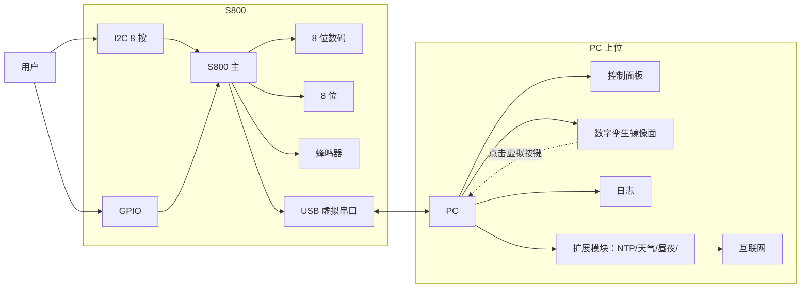

# 大作业题目：智能联网时钟系统

学生版功能描述文档  
版本：V1.2  
发布日期：2026-06-01

提交至 Canvas 对应作业。具体起止时间以 Canvas 公告为准。

## 1. 作业概述

利用 S800 板与 PC 上位机软件，共同搭建一台**能本地独立运行、又可与 PC 双向协同**的数字时钟系统。系统应满足以下整体目标：

- S800 板在不连接 PC 的情况下，能独立完成时钟、闹钟、按键设置等全部本地功能。
- PC 端通过 USB 虚拟串口与 S800 板通信，实现远程控制、状态监视、镜像显示等扩展能力。
- **PC 上位机提供与 S800 板 1:1 镜像的数字孪生面板**（8 位数码管 + 8 位 LED + 8 位按键 + USER1 / USER2 软件仿真），与硬件实物**双向同步**：板上任何按键、显示、LED 状态变化即时反映到 PC，PC 上点击虚拟按键也等效于按下板上物理按键。这是本作业的核心特色，使开发、调试、演示均可在双窗口下进行。
- 两端协议统一、容错可靠、具备工程化提交质量。

**总分 100**（含扩展功能 8 分、自主增加功能 8 分）。提交形式：≤ 5 分钟带旁白演示视频/PPT + 工程目录 zip + 简介 PDF。

## 2. 硬件资源与系统架构

### 2.1 硬件资源

| 资源 | 用途 |
|---|---|
| USB 虚拟串行口 | 与 PC 上位机通信，唯一对外通道 |
| 8 位动态七段数码管（I2C） | 时钟显示、滚动消息、扩展短显、开机画面 |
| 8 位按键（I2C）+ USER1 / USER2（GPIO） | 本地设置、扩展功能触发 |
| 8 位 LED | 心跳/状态/扩展信息指示 |
| 蜂鸣器 | 闹钟、远程触发、操作反馈 |

PC 端默认技术栈推荐 **Python + PyQt5 + pyserial**，亦可使用 C# WinForm/WPF、Qt C++ 等等价方案，功能要求一致。

### 2.2 系统架构框图



架构说明：I2C 8 按键与 GPIO USER1/USER2 是两条独立路径；PC 镜像面板点击虚拟按键走 `*SET:KEY` 下行回路（虚线），构成双向同步。

## 3. S800 板端功能要求（全部必做）

以下 6 项构成 S800 板端基础部分，**必须在不连接 PC 的情况下独立运行**。

### 3.1 开机画面

1. 8 位数码管 + 8 位 LED 全亮 → 全灭，闪烁 ≥ 1 次。
2. 数码管显示**学号后 8 位**并闪烁 1 次，LED 同步闪烁。
3. 数码管显示**姓名拼音**（≤ 8 字符）并闪烁 1 次。
4. 显示软件版本号 ≥ 1 秒后进入正常时钟显示。

### 3.2 时钟与日期显示

- 默认显示时间 `HH.MM.SS`，按键可切换显示日期 `YY.MM.DD` 或 `YYYY.MMDD`。
- 闰年、月末进位（28/29/30/31）必须正确。
- 走时基准来自 1 ms 系统时基，秒不丢、不抖。
- 接收 `*SET:DISP[lay] OFF` 指令时整屏熄灭，`ON` 时恢复（命令完整规范见 §5.2）。

### 3.3 流水显示

- 当显示内容多于 8 位时按固定速率流水。
- 方向取自 `*SET:FORMAT LEFT/RIGHT`（命令见 §5.2），本地按键 `FORMAT` 等价切换。
- 速度 **2 级可调**，由按键 `SPEED` 切换。
- **小数点随方向跟随**：左→右用本位小数点，右→左用下一位小数点。

### 3.4 闹钟功能

- 时分秒同时相等触发；蜂鸣器以**节奏式响铃**（响-停-响），持续 ≤ 10 秒自动停止。
- **闹钟响铃中按 `FUNC` 立即停止**；响铃期间 `FUNC` 优先于编辑模式切换。
- 闹钟使能/响铃状态须用 LED 指示。

### 3.5 按键设置（编辑状态机）

- 短按 `FUNC`：进入并循环切换编辑模式「日期 → 时间 → 闹钟 → 退出」（响铃中除外，见 §3.4）。
- `SHIFT`：循环高亮（闪烁）当前编辑字段。
- `ADD`：当前字段循环加 1，含进位与范围钳制。
- `SAVE` 或长按 `FUNC`：保存并退出（两者等效）。
- **5 秒无任何按键操作自动退出且不保存**。
- 1 秒内可连续按 ≥ 3 次按键不丢键。

### 3.6 LED 辅助指示

- 8 位 LED 全部使用，每位含义须在简介文档中明确说明。
- 至少包含：系统心跳、闹钟状态、编辑模式、串口收发活动四类指示。

### 3.7 按键完整映射

| 标签 | 位置 | 短按功能 | 长按功能 |
|---|---|---|---|
| `FUNC` | K1 | 编辑模式切换；响铃中关闹钟 | 保存并退出（同 `SAVE`） |
| `SHIFT` | K2 | 编辑中切换高亮字段 | - |
| `ADD` | K3 | 当前字段 +1 | 连加（≥ 5 Hz） |
| `SAVE` | K4 | 保存并退出编辑 | - |
| `DISP` | K5 | 主显示切换：时间 / 日期 / 年份 | - |
| `SPEED` | K6 | 流水速度 2 级切换 | - |
| `FORMAT` | K7 | 流水方向切换（等价 `*SET:FORMAT`） | - |
| `EXT` | K8 | 预留键，仅触发 `*EVT:KEY EXT` | - |
| `USER1` | GPIO | 请求 PC 对时（触发 `*EVT:KEY USER1`） | - |
| `USER2` | GPIO | 数码管短显天气 5 秒（需 PC 先下发） | - |

协议中 `*SET:KEY` 与 `*EVT:KEY` 的 `<NAME>` 取值即上表第 1 列共 10 项。

## 4. PC 上位机功能要求

### 4.1 核心功能（必做）

| 编号 | 功能 | 关键要求 |
|---|---|---|
| P1 | 串口管理与状态栏 | 自动扫描 COM、连接/断开、后台读、心跳与延迟显示；状态栏实时显示连接状态、FORMAT（LEFT/RIGHT）、MODE（DAY/NIGHT）、ALARM 使能四项 |
| P2 | 控制面板 | 覆盖全部串口命令的可视化下发；提供“参数组合下拉”≥ 3 种、“缩写演示按钮”、“大小写混合演示按钮” |
| P3 | 数字孪生镜像面板 | 软件仿真 8 位 7SEG + 8 位 LED + 8 位按键 + USER1 / USER2（USER1/USER2 为独立可点击控件），与 S800 板双向同步：SEG 镜像根据 `*EVT:DISP <8字符> <dpHex>` 渲染，**必须正确复现小数点**；LED 镜像根据 `*EVT:LED <hex2>` 逐位解码亮灭；点击虚拟按键 → 下发 `*SET:KEY <NAME>`，S800 板等同物理按键效果；镜像须跟随 `*EVT:MODE`：NIGHT 下仅点亮时分 4 位、LED 仅保留心跳，与 S800 板一致；依赖 §5.3 的 1 Hz 全量心跳自动校准，无需额外重传机制 |
| P4 | 收发日志 | 时间戳 + 方向标记 + 颜色编码（发送/应答/事件/错误），可导出 |
| P5 | 异常处理 | 串口占用、解析异常、网络超时、S800 板 `ERROR` 应答全部弹窗或日志高亮，GUI 不崩溃 |

### 4.2 扩展功能（推荐选做）

| 编号 | 功能 | 简要说明 |
|---|---|---|
| E1 | 网络对时 | 一键从 NTP 服务器获取标准时间下发到 S800 板，S800 板用某位 LED 指示同步状态；**PC 须监听 `*EVT:KEY USER1` 并自动触发与点击 NTP 按钮等同的对时流程** |
| E2 | 天气获取 | 自动获取本地天气（温度 + 天气状况），通过协议下发；S800 板用 LED 编码指示晴/雨/高温，按 `USER2` 数码管短显天气 5 秒（短显期间 `*EVT:DISP` 照常上报，PC 镜像自动跟随） |
| E3 | 自动昼夜模式 | PC 计算当地日出日落时刻，自动下发 `*SET:MODE DAY/NIGHT`：DAY 显示完整 8 位 + LED 全启用；NIGHT 仅显示时分 4 位 + LED 仅保留心跳 + 蜂鸣抑制 |
| E4 | 数据可视化看板 | 持久化记录闹钟/对时/事件等日志，绘制图表展示 |

扩展功能计入总分 8 分（E1 2 / E2 3 / E3 2 / E4 1），**不得以扩展功能替代核心功能**。最终成绩达 A / A+（≥ 90）者需至少完成 2 项扩展，详见 §6.1 高分门槛。

### 4.3 自主增加功能（高分必选 · 8 分）

学生须**自行设计并实现至少 1 项原创功能**，可落在 S800 板侧、PC 侧或两端联动。要求：

- 不与 §3 / §4.1 / §4.2 已有功能重复，具备明确的用户价值或工程创新点。
- 在简介 PDF 中列出“动机—设计—实现—演示”四段说明，并标注关键代码位置。
- 在演示视频中完整呈现该功能的使用流程。

评分由教师综合创意、完成度、工程质量裁定，满分 8 分（不再细分子项）。常见方向举例（非限定）：手势/语音交互、传感器接入、个性化主题、远程 OTA、PC 语音播报、自动化测试脚本、与移动端 H5 联动等。

本项是 A / A+ 高分门槛之一，详见 §6.1。

## 5. 串口通信协议

### 5.1 帧格式与容错规则

| 项 | 值 |
|---|---|
| 波特率 | 115200，8N1，无流控 |
| 字符编码 | ASCII |
| 行结束符 | `\r` / `\n` / `\r\n` 任一 |
| 单帧最大长度 | 64 字节 |

容错规则：

1. **大小写不敏感**：命令、子命令、参数项的字面量大小写均合法。
2. **空格容错**：命令与参数、参数与参数之间允许 1 个或多个空格/Tab。
3. **缩写规则**：命令格式中**大写字母为必输部分，小写字母可省略**。例：`MINute` 可写成 `MIN`/`MINU`/`MINUT`/`MINUTE`，但不能为 `MI`。
4. **回车结束**：所有命令以行结束符提交。
5. 错误命令必须回应 `ERROR <reason>`，不得静默丢弃。
6. §4.3 自主增加功能若扩充协议命令，需沿用 `*` 前缀与本节容错规则，且不得与 §5.2 / §5.3 已有命令冲突。

### 5.2 PC → S800 板命令总表

| 命令 | 子命令 | 参数 | 说明 |
|---|---|---|---|
| `*RST` | - | - | 复位时钟/日期/闹钟，DISPLAY=ON，FORMAT=LEFT |
| `*SET` | `:DATE` | `YEAR` / `MONTH` / `DATE` | 单参或任意组合 |
| `*SET` | `:TIME` | `HOUR` / `MINute` / `SECond` | 单参或任意组合 |
| `*SET` | `:ALARM` | `HOUR` / `MINute` / `SECond` / `OFF` | 设置后自动启用 |
| `*SET` | `:DISPlay` | `ON` / `OFF` | 数码管亮灭 |
| `*SET` | `:FORMAT` | `LEFT` / `RIGHT` | 显示与应答方向 |
| `*SET` | `:MSG` | `<text>` | ≤ 32 字节滚动消息，保留原大小写 |
| `*SET` | `:BEEP` | `<ms>` | 10-5000 ms 远程蜂鸣 |
| `*SET` | `:LED` | `<hex2>` | 直接设置 LED 字节 |
| `*SET` | `:KEY` | `<NAME>` | 模拟按键，`<NAME>` 取值见 §3.7（10 项）；模拟执行后不再上报 `*EVT:KEY`，避免 PC↔板环回 |
| `*SET` | `:MODE` | `DAY` / `NIGHT` | 昼夜模式（扩展） |
| `*GET` | `:DATE` / `:TIME` / `:ALARM` / `:DISPlay` / `:FORMAT` | 同 SET 参数或省略 | 查询并应答 |
| `*PING` | - | - | 心跳，S800 板应答 `*PONG <uptime_s>` |

参数组合示例（任选 ≥ 3 种）：

```text
*SET:DATE YEAR MONTH DATE 2026 06 01
*SET:DATE YEAR DATE 2026 01
*SET:DATE MONTH DATE 06 01
*SET:TIME HOUR MIN SEC 12 30 45
*SET:TIME HOUR SEC 12 45
```

应答：成功 `OK [<data>]`；失败 `ERROR SYNTAX/PARAM/RANGE/LEN/BUSY` 之一。

### 5.3 S800 板 → PC 主动报文（用于数字孪生与日志）

| 报文 | 触发 |
|---|---|
| `*EVT:KEY <NAME>` | 物理按键按下（`<NAME>` 见 §3.7） |
| `*EVT:ALARM` / `*EVT:ALARM_OFF` | 闹钟开始/停止响 |
| `*EVT:EDIT <TYPE> <VALUE>` | 本地编辑保存 |
| `*EVT:DISP <8字符> <dpHex>` | 显示变化或 1 秒心跳；`<8字符>` 定长 8（以 `_` 填空，不含小数点），`<dpHex>` 2 位 hex 表示 8 位小数点状态 |
| `*EVT:LED <hex2>` | LED 变化或 1 秒心跳 |
| `*EVT:MODE <STATE>` | 模式切换 |
| `*PONG <uptime_s>` | 应答 PING |

`*EVT:DISP` 与 `*EVT:LED` 每秒发送一次（即使无变化），既作增量上报又作 1 Hz 全量心跳，PC 据此自动覆盖任何丢失事件，无需重传机制。

### 5.4 关键说明：FORMAT RIGHT 行为

设当前时间为 `12:30:45`：

| 命令 | LEFT 应答 | RIGHT 应答 |
|---|---|---|
| `*GET:TIME` | `OK 12.30.45` | `OK 54.03.21` |

数码管显示同步逆序，**小数点位置按下一位规则跟随**（在 7SEG 上呈现为 `54.03.21`）。

### 5.5 完整会话示例

```text
PC      : *PING
S800 板 : *PONG 132
PC      : *SET:DATE YEAR MONTH DATE 2026 06 01
S800 板 : OK
S800 板 : *EVT:EDIT DATE 2026.06.01
PC      : *SET:MSG Hello Clock
S800 板 : OK
S800 板 : *EVT:DISP HELLO_CL 00
PC      : *GET:TIME
S800 板 : OK 12.30.46
PC      : *SET:FORMAT RIGHT
S800 板 : OK
PC      : *GET:TIME
S800 板 : OK 64.03.21
S800 板 : *EVT:KEY USER2
```

## 6. 评分标准

### 6.1 分数分布（满分 100）

| 大类 | 分值 | 说明 |
|---|---:|---|
| S800 板基础（§3 全部） | 52 | 显示稳定、按键稳定、开机画面、时钟、流水、闹钟、编辑、LED |
| 串口协议完整性（§5.1-5.2） | 10 | 容错三件套 + 多参数组合 + FORMAT 正确 |
| PC 协同（§4.1） | 14 | 控制面板 + 数字孪生镜像 + 事件同步 + 日志 |
| 主观分（视频、文档、亮点） | 4 | 拍摄讲解、文档质量、设计创新 |
| 工程结构与提交规范 | 4 | 目录、命名、文档完整 |
| 扩展功能（§4.2） | 8 | E1 +2 / E2 +3 / E3 +2 / E4 +1 |
| 自主增加功能（§4.3） | 8 | 原创功能，高分必选 |

**高分门槛（总分 ≥ 90，即 A / A+）**：需同时满足以下全部条件，否则即使各分项相加达 90，总分按 **89 分封顶**：

1. 自主增加功能（§4.3）得分 > 0。
2. 扩展功能（§4.2）至少完成 2 项（得分 ≥ 4）。
3. 自我报名参加答辩并通过（详见 §9）。

### 6.2 评分硬指标与扣分清单

技术硬指标（不达标按对应大类扣分）：

- 显示稳定无闪烁、无不连续、亮度均匀。
- 按键 1 秒内连续按 3 次以上无丢键。
- 编辑状态 5 秒无操作自动退出。
- 串口大小写不敏感、空格容错、缩写合法。
- `*SET:FORMAT RIGHT` 后所有应答与显示逆序，**小数点位置必须正确跟随**。
- PC 数字孪生面板必须完整呈现 8 SEG + 8 LED + 8 按键 + USER1 / USER2 四组组件，且与 S800 板双向同步（编辑态字段高亮属 S800 板本地行为，**不强制镜像**到 PC）。
- 所有自编代码集中放 `main.c`。

违规扣分：

- **查重相似度 > 80%**：双方均判 0 分。
- 烧写后不能运行：扣 20 分。
- 缺源代码 / 缺 `.axf` / 缺文档 / 缺视频：每项扣 10 分。
- 自编代码未集中放 `main.c`：扣 3 分。
- 视频超过 5 分钟：扣 2 分；视频无旁白：扣 3 分。
- 命名不规范：扣 2 分。
- §4.3 自主增加功能未在 PDF 或视频中重现：该项计 0 分（并触发 §6.1 高分门槛 89 封顶）。
- 答辩抽查关键模块讲不清：按比例扣分。

提交前请对照上表逐项自查。

## 7. 提交要求

### 7.1 工程目录结构

```text
大作业<学号>-<姓名>/
├── mcu/
│   ├── Inc/                         共用头文件
│   ├── Driverlib/                   硬件驱动库（保留原样）
│   ├── src/main.c                   自编代码集中于此
│   ├── src/...                      其他模块文件
│   └── obj/xxx.axf                  编译输出，必须可烧写
├── pc_host/
│   ├── *.py / *.ui                  源代码
│   └── requirements.txt
├── docs/
│   ├── 大作业<学号>-<姓名>.pdf      简介文档
│   └── 演示视频.mp4 或 .pptx
└── README.md                        编译/运行说明
```

### 7.2 命名规范

- 压缩包：`大作业<完整学号>-<中文真名>.zip`（学号位数以 Canvas 公告为准）。
- 简介文档：`大作业<学号>-<姓名>.pdf`（或 `.doc`）。
- 示例（姓名“交小电”、学号 567890123456）：
  - 压缩包：`大作业567890123456-交小电.zip`
  - 压缩包内顶层目录：`大作业567890123456-交小电/`
  - 简介文档：`大作业567890123456-交小电.pdf`

### 7.3 必交清单

- [ ] 全部 S800 板与 PC 端源代码（含 `.ui` 文件）
- [ ] `obj/xxx.axf` 可烧写文件
- [ ] PC 端 `requirements.txt`
- [ ] 简介 PDF（4-8 页，含框图、关键代码片段、亮点说明、难点解决、§4.3 自主增加功能“动机—设计—实现—演示”四段说明）
- [ ] 演示视频（≤ 5 分钟带旁白，必须覆盖 §3 必做、§4.2 已完成扩展、§4.3 自主增加功能三部分）
- [ ] 项目根 `README.md`（编译/运行命令）

## 8. 阶段进度建议（3 周）

系统时基、7SEG 显示驱动、按键扫描、UART 接收中断等底层驱动默认已在课程实验阶段完成并验证。本大作业三周主要用于业务层集成与协同开发。

| 阶段 | 重点 | 阶段验收 |
|---|---|---|
| 第 1 周 工程整合 | 复用实验阶段底层驱动，搭建主工程框架；完成开机画面、时钟走时、日期/时间显示；UART 能接收行并打印 | 烧写后能完整走时显示，串口可回显输入行 |
| 第 2 周 本地业务 | 左/右流水（含小数点跟随）、闹钟、编辑状态机、串口指令完整集（容错三件套、多参数组合）；**启动 §4.3 自主增加功能选题与原型** | 离线本地运行 §3 全部功能；串口 12 条命令全通；自主功能原型可运行 |
| 第 3 周 协同与提交 | PC 上位机核心功能（串口/控制面板/**数字孪生镜像**/日志/异常处理）、S800 板事件上报与镜像联调、按需选做扩展功能、**完成自主增加功能并纳入演示**、录制视频与撰写简介 PDF | PC 数字孪生面板与 S800 板实物镜像同步；自主增加功能在 PDF 与视频中均完整呈现；提交材料齐全 |

建议节奏与验收：

- 工作量占比约 **20% / 35% / 45-50%**；首次接触 PyQt 自绘的同学建议第 2 周末即预热 PC 项目骨架，P3 数字孪生耗时容易超预期。
- 验收节点：第 1 周末可看到完整开机画面 + 走时；第 2 周末仅靠本地按键与串口助手可达 §3 + §5.1-5.2 全部要求，可独立录“本地版”视频备用；第 3 周末（提交前 1-2 天）可拍 PC 镜像面板与 S800 板双窗口同步演示。

建议每周末打包一次工程，避免后期改坏前期功能无法回退。

## 9. 答辩说明

答辩分两类：（1）**抽查答辩**——对查重存疑、主观分有疑义的提交抽取部分进行；（2）**报名答辩**——希望冲击 A / A+（≥ 90）的学生需**自我报名**（在简介 PDF 首页勾选或在 Canvas 指定入口提交）。未报名或报名答辩未通过者总分按 **89 分封顶**。

老师可以由以下方向提问：系统时基 / I2C 显示扫描 / 按键防抖、编辑状态机与 5 秒超时、串口容错与缩写处理、`*SET:FORMAT RIGHT` 小数点跟随实现、PC 数字孪生与 S800 板双向同步机制（事件上报/心跳/丢包恢复）、**自主增加功能的设计与关键代码**、扩展功能联调、开发难点与解决方案。

**准备要点**：在简介 PDF 中标注关键代码文件与行号；现场应能复述代码设计意图并修改一处参数解释影响；现场讲解与提交材料应完全一致。

**与评分关系**：抽查通过则维持原评分；报名答辩关键模块讲不清则未通过、总分 89 封顶；现场与提交明显不一致者进入查重与抄袭复审流程。
